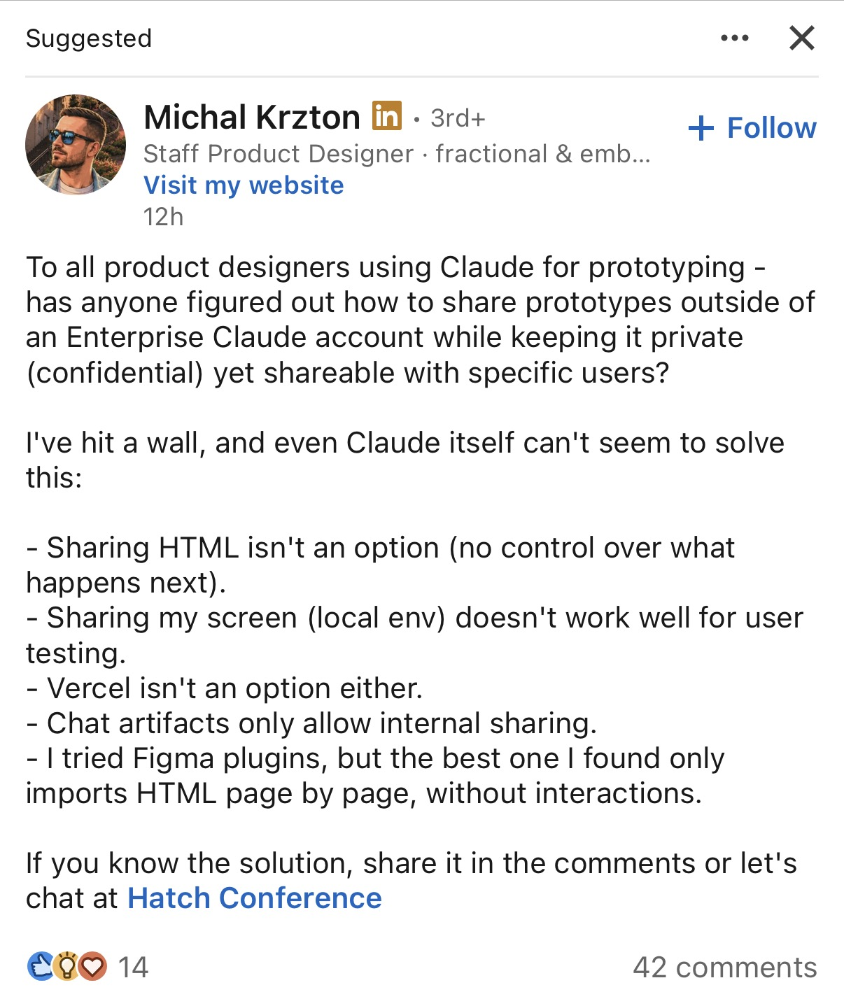

# Why I built this, and where it took me

## The shift

Product designers can now make working prototypes in code. Claude, v0, Lovable and their kind turn a description into HTML and JavaScript that behaves like the real thing: forms validate, states change, flows branch. A designer can hand a tester something that works, not a click-through.

Showing that work is the part I kept getting stuck on. A coded prototype has to be hosted somewhere, and I did not have a place that was private, shareable with specific people, and something my company would allow. I do not know how common that is. I know one other designer said the same thing in public, and that is the post below.

## The post that started this

Michal Krzton, a staff product designer, wrote this on LinkedIn in September 2026. When I saw it, twelve hours after he posted it, it had 42 comments.

The same words, for search and screen readers:

> To all product designers using Claude for prototyping - has anyone figured out how to share prototypes outside of an Enterprise Claude account while keeping it private (confidential) yet shareable with specific users?
>
> I've hit a wall, and even Claude itself can't seem to solve this:
>
> - Sharing HTML isn't an option (no control over what happens next).
> - Sharing my screen (local env) doesn't work well for user testing.
> - Vercel isn't an option either.
> - Chat artifacts only allow internal sharing.
> - I tried Figma plugins, but the best one I found only imports HTML page by page, without interactions.

I recognised every line. I wanted to know what it would take to answer it properly, not with a workaround but with something a designer could run, and something a security team could read.

## What the post asks for

The post names four things and says what he tried for each. I have not asked him why Vercel was out; I assume policy, because that was my case too.

| What the post asks for                        | What he tried, in his words                                        |
| --------------------------------------------- | ------------------------------------------------------------------ |
| Private, outside an Enterprise Claude account | "Chat artifacts only allow internal sharing"                       |
| Shareable with specific users                 | "Sharing HTML isn't an option (no control over what happens next)" |
| Usable for user testing                       | "Sharing my screen (local env) doesn't work well"                  |
| The interactions kept                         | Figma plugins "import HTML page by page, without interactions"     |

I added two requirements of my own, because I think they follow from "control over what happens next" and from wanting a security team to say yes. They are my reading, not his:

- The designer keeps control after sharing: links expire, can be withdrawn, and leave a record.
- A security reviewer can see what the tool does, where data lives, and that it phones home to nothing.

## What the comments said

Four days after the post I read every comment, forty-odd, and sorted them. This is one thread, read by one person, so it is a first signal and not a study. I have kept people's words where they matter and grouped the rest. The trade-offs column is my reading.

Most people were describing something they use. A few were selling something they built. Nobody had an answer Michal accepted; his last word was that he would try GitHub again on Monday.

| What people suggested                                                                         | Who, roughly                                                                                                                                                                                                                        | Tried it, or an idea?                  | What it solves                                         | What it does not                                                                                                    |
| --------------------------------------------------------------------------------------------- | ----------------------------------------------------------------------------------------------------------------------------------------------------------------------------------------------------------------------------------- | -------------------------------------- | ------------------------------------------------------ | ------------------------------------------------------------------------------------------------------------------- |
| Hosting the company already allows: private GitHub Pages, Azure, Cloudflare, an intranet      | The largest group, and the most upvoted answers in the thread                                                                                                                                                                       | Tried, by most of them                 | Private, no new vendor, IT already says yes            | Company people only, as one of them said. No per-person links, no expiry, no log, nothing about what the tester did |
| A hosting service with a password: tiinyhost, Netlify, Vercel, a Cloudflare worker            | Several                                                                                                                                                                                                                             | Tried                                  | Quick, cheap, a password on the door                   | It is the unauthorised tool the post ruled out. One password for everyone, forwardable                              |
| Figma Make: paste the HTML in, share it like a Figma prototype                                | Two, and Michal was interested                                                                                                                                                                                                      | Tried by one                           | Stays inside a tool the company already approved       | The prototype has to live in Figma; the post's prototype lives in Claude                                            |
| Build your own: a small server with login, per-person links, time limits                      | A product design leader built one with company login and opened it to customers. A second designer is building one with signed, temporary links. A UX design engineer described one from scratch and said vibe coding could make it | Built, building, and an idea, one each | Exactly the four things the post asks for              | Someone has to build it, and then run it. Each of them built it alone                                               |
| A product: Artor, Magnettic, shareview, Rork, Guing                                           | Five founders or teams                                                                                                                                                                                                              | Their own                              | Comments, versions, links that expire, a walled garden | All third-party hosting, so all fail the post's first line. None got more than a few likes                          |
| A tunnel from your own machine: Cloudflare tunnel, Tailscale, a local server on the same wifi | Two                                                                                                                                                                                                                                 | One tried, one idea                    | Nothing leaves your laptop                             | Your laptop has to stay on, and testers must be on your network or you need the tunnel vendor                       |
| Change the policy, or ask legal to approve a domain                                           | Two                                                                                                                                                                                                                                 | Ideas                                  | The proper fix                                         | "Not in just a few days," as Michal said                                                                            |

Three things I took from it.

- **The real alternative to Vantage is a private GitHub Page, not any product.** It is free and already approved. It loses the moment the tester is outside the company, and it never had per-person links, revoking, expiry, a log, or results. Those five things are the case for running one more thing.
- **The shape people want is an internal tool, not a subscription.** Three senior designers hand-built the same small server with login and temporary links, each on their own. That is what Vantage is, written once so the next person does not have to.
- **Two rules from the thread that I adopted.** Participants must not have to install anything (one commenter, and Michal agreed), so the browser is the default and the desktop viewer is optional. And "private, interactive, and accessible to specific testers without enterprise tooling is where things get messy" (a product design partner for B2B teams) is the sentence the product has to answer.

## Where it took me

The first version was a single Node file: upload a folder, hand out links, serve the pages. That took an afternoon and answered the post on the surface.

Then I asked what a security reviewer would say, and the answer reshaped the whole thing. A prototype is untrusted code; if it runs on the same origin as the console, it can read the console. So prototypes moved to their own origin, inside a locked-down frame, with a content policy that stops them reaching anywhere else. Personal links became secrets that travel in the URL fragment, are stored only as hashes, and are shown once. Files and metadata became encrypted on disk with a key the operator holds. The server makes no outbound calls at all.

Then I asked what the designer actually wants after sharing, which is to learn something. So a share can become a usability test: tasks that appear on a schedule, a consent screen before anything is recorded, interaction recording, written feedback, optional voice and screen recording, and a results page with an exportable report. Claude can publish to it and read the results back, because that is where these prototypes are made.

Then I read every line again with the question "how does someone break this". That produced nineteen findings, two of them rated high. Seventeen were fixed the same day; the other two are done in code and wait on infrastructure or a product decision. The review is written up in [docs/AUDIT.md](docs/AUDIT.md), with what was tested in [docs/TESTING.md](docs/TESTING.md). It is the part of the project I would point at first: the build is the easy half.

## Who I built it for

Nobody but me has used it yet, so this is intent, not evidence.

- A designer, or a small team, who can run one Node process, or whose IT can. Node is the only thing to install.
- People whose testers are named and few: a handful of customers, colleagues or partners, each with their own link that can be withdrawn.
- Anyone running a short unmoderated or moderated usability test on a coded prototype and wanting the record afterwards: who opened it, what they did, what they said.
- Anyone whose company forbids third-party hosting. Nothing leaves the server, there are no dependencies, and the code is there to read before trusting it.

## Who it does not help, and why

- **Anyone who needs an audited product.** This was built in two days with Claude Code and reviewed only by me. No outside security firm has seen it. A company with a procurement process will, rightly, want that first. [docs/SECURITY.md](docs/SECURITY.md) is written for that reviewer.
- **Anyone who needs to stop a screenshot or a forwarded link.** Nothing can. A watermark names the viewer, a passcode or a Google sign-in check makes a forwarded link useless, and the desktop viewer hides its window from screen capture, but a phone pointed at a screen defeats all of it. [docs/WHAT-IT-CANNOT-DO.md](docs/WHAT-IT-CANNOT-DO.md) says this plainly, for designers rather than engineers.
- **Prototypes that depend on the outside world.** A prototype that calls an API, loads a font from a CDN or embeds a map is blocked unless the operator allows that origin, because the whole point is that nothing leaks. The command-line tool can bundle CDN assets locally; live APIs are out.
- **Teams that want Figma-style commenting, versions or a recruiting panel.** None of that is here. It shares, gates, records and reports.
- **Designers without a server and without IT.** There is no public hosted copy yet. The code supports a hosted deployment with Google sign-in, and the deployment guide has the recipe, but someone has to run it.

## The limits of this build

- One process, one JSON file for metadata, files on local disk. It has only been run by me, with a few shares and no real testers. I do not know where it falls over.
- The console and tester pages have no automated browser tests. The server has twenty end-to-end tests; the pages were checked by hand.
- On a hosted copy, two prototypes opened in one browser share an origin unless the operator sets up wildcard DNS. The code supports it; the infrastructure is the operator's.
- Whoever runs the server can see everything on it. That is true of every self-hosted tool and worth saying out loud.

The answer in this folder is **Vantage**. What it is and how to try it in three steps is in [README.md](README.md).
